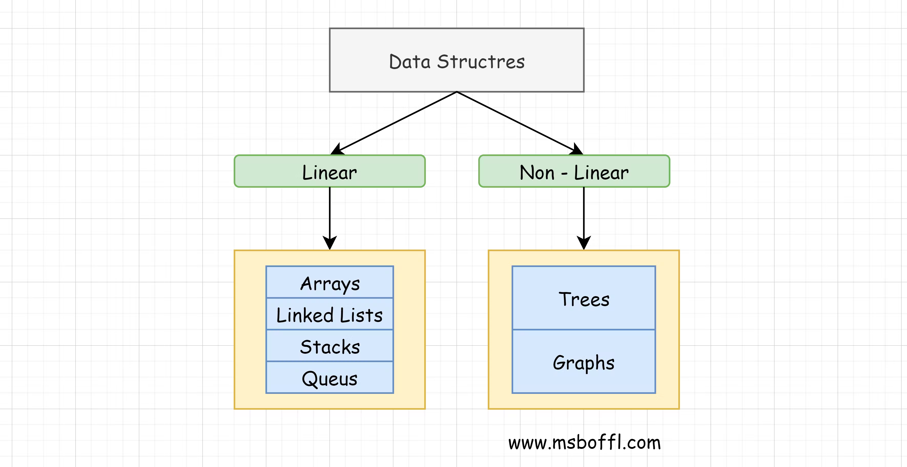

# What is Data Structure
Data structure is a particular way of storing and organizing a data in a computer so that it 
can be used efficiently. A data structure is a special format for organizing and storing 
data. General data structure types include ```arrays, files, linked lists, stacks, queues, trees, 
graphs``` and so on.

## Types of Data Structures
These data structures are classified into ```two``` categories



1. **Linear Data Structures** : Elements are accessed in a sequential order but it is not 
compulsory to store all elements sequentially (say, Linked Lists).

   > _**Examples**_ : Arrays, Linked Lists, Stacks and Queues.

2. **Non-Linear Data Structures** : Elements of this data structure are stored/accessed 
in a non sequential or non-linear order.

    > _**Examples**_ : Trees and graphs.

# Abstract Data Types (ADTs)

Before defining abstract data types, let us consider the different view of system-defined data
types. We all know that, by default, all primitive data types (int, float, etc.) support basic
operations such as addition and subtraction. The system provides the implementations for the
primitive data types. For user-defined data types we also need to define operations. The
implementation for these operations can be done when we want to actually use them. That means,
in general, user defined data types are defined along with their operations.

To simplify the process of solving problems, we combine the data structures with their operations
and we call this Abstract Data Types (ADTs). An ADT consists of two parts:
1. Declaration of the data
2. Declaration of operations

Commonly used ADTs include: Linked Lists, Stacks, Queues, Priority Queues, Binary Trees,
Dictionaries, Disjoint Sets (Union and Find), Hash Tables, Graphs, and many others. For
example, stack uses LIFO (Last-In-First-Out) mechanism while storing the data in data structures.
The last element inserted into the stack is the first element that gets deleted. Common operations
of it are: creating the stack, pushing an element onto the stack, popping an element from stack,
finding the current top of the stack, finding number of elements in the stack, etc.

While defining the ADTs do not worry about the implementation details. They come into the
picture only when we want to use them. Different kinds of ADTs are suited to different kinds of
applications, and some are highly specialized to specific tasks. By the end of this book, we will
go through many of them and you will be in a position to relate the data structures to the kind of
problems they solve.

# What is Algorithm

Let us consider the problem of preparing an omelette. To prepare an omelette, we follow the
steps given below:

```markdown
1) Get the frying pan.
2) Get the oil.
   a. Do we have oil?
      i. If yes, put it in the pan.
      ii. If no, do we want to buy oil?
             1. If yes, then go out and buy.
             2. If no, we can terminate.
3) Turn on the stove, etc...
```
   > _**Examples**_ : Searching, Sorting, String Algorithms, Greedy Algorithms. 

What we are doing is, for a given problem (preparing an omelette), we are providing a step-bystep
procedure for solving it. The formal definition of an algorithm can be stated as:

> An algorithm is the step-by-step unambiguous instructions to solve a given problem.

## Analysis of Algorithms

The goal of the analysis of algorithms is to compare algorithms (or solutions) mainly in terms of
running time but also in terms of other factors.

To go from city “A” to city “B”, there can be many ways of accomplishing this: by flight, by bus,
by train and also by bicycle. Depending on the availability and convenience, we choose the one
that suits us. Similarly, in computer science, multiple algorithms are available for solving the
same problem (for example, a sorting problem has many algorithms, like insertion sort, selection
sort, quick sort and many more). Algorithm analysis helps us to determine which algorithm is
most efficient in terms of time and space consumed.

