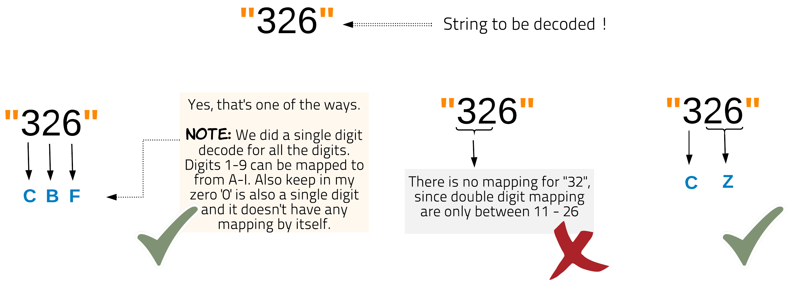
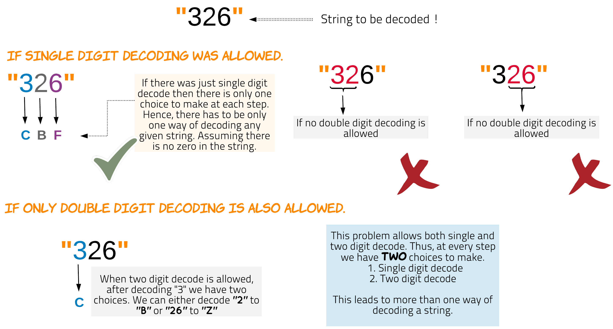
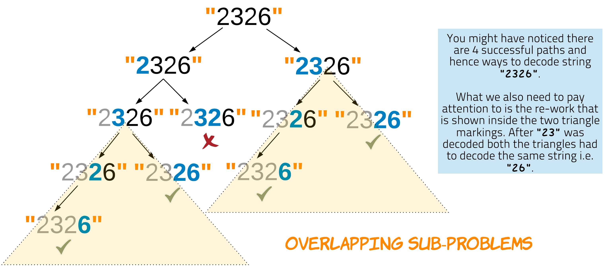

# Solutions
The most important point to understand in this problem is that at any given step when you are trying to decode a string of numbers it can either be a single digit decode e.g. ```1 to A``` or a double digit decode e.g. ```25 to Y```. As long as it's a valid decoding we move ahead to decode the rest of the string.

The subproblem could be thought of as number of ways decoding a substring.



The above diagram shows string "326" could be decoded in two ways.

## Approach 1: Recursive Approach with Memoization

The problem deals with finding number of ways of decoding a string. What helps to crack the problem is to think why there would be many ways to decode a string. The reason is simple since at any given point we either decode using ```two digits``` or ```single digit```. This choice while decoding can lead to different combinations.



Thus at any given time for a string we enter a recursion after successfully decoding two digits to a single character or a single digit to a character. This leads to multiple paths to decoding the entire string. If a given path leads to the end of the string this means we could successfully decode the string. If at any point in the traversal we encounter digits which cannot be decoded, we backtrack from that path.


In the following diagram we can see how the paths have to deal with similar subproblems. Overlapping subproblems means we can reuse the answer. Thus, we do memoization to solve this problem.



### Algorithm

1. Enter recursion with the given string i.e. start with index 0.

2. For the terminating case of the recursion we check for the end of the string. If we have reached the end of the string we return 1.

3. Every time we enter recursion it's for a substring of the original string. For any recursion if the first character is 0 then terminate that path by returning 0. Thus this path won't contribute to the number of ways.

4. Memoization helps to reduce the complexity which would otherwise be exponential. We check the dictionary memo to see if the result for the given substring already exists.

5. If the result is already in memo we return the result. Otherwise the number of ways for the given string is determined by making a recursive call to the function with index + 1 for next substring string and index + 2 after checking for valid 2-digit decode. The result is also stored in memo with key as current index, for saving for future overlapping subproblems.

```python
from functools import lru_cache


class Solution:
    def decodeWays(self, s):
        return self.recursiveWithMemo(0, s)
        lru_cache(maxsize=None)

    def recursiveWithMemo(self, index, s) -> int:
        # If you reach the end of the string
        # Return 1 for success.
        if index == len(s):
            return 1

        # If the string starts with a zero, it can't be decoded
        if s[index] == '0':
            return 0

        if index == len(s) - 1:
            return 1

        answer = self.recursiveWithMemo(index + 1, s)
        if int(s[index: index + 2]) <= 26:
            answer += self.recursiveWithMemo(index + 2, s)

        return answer


T = int(input("Enter no. of test cases: "))
for _ in range(T):
    s = str(input("Enter the string: "))
    Obj = Solution()
    ans = Obj.decodeWays(s)
    print(ans)

```
### Complexity Analysis

**Time Complexity**: ```O(N)```, where N is length of the string. Memoization helps in pruning the recursion tree and hence decoding for an index only once. Thus this solution is linear time complexity.

**Space Complexity**: ```O(N)```. The dictionary used for memoization would take the space equal to the length of the string. There would be an entry for each index value. The recursion stack would also be equal to the length of the string.

